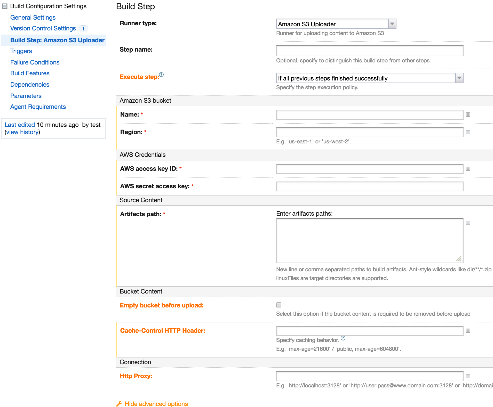

# TeamCity Plugin: Amazon S3 Uploader

This TeamCity plugin allows to upload content into different Amazon S3 buckets. It also allows to delete the existing content on the bucket before uploading.

As a Build Runner, it can be set up for each build configuration as a build step, allowing to define different users and/or buckets.

## Introducing the plugin...

> This plugin has been tested on TeamCity 9.0.3+

## Installing the Plugin

- Download the [current version of the plugin](https://drive.google.com/open?id=0BxGdXmEjPnyPa2thM3FCdUh0SmM)

- Refer to [TeamCity Installing Additional Plugins](https://confluence.jetbrains.com/display/TCD9/Installing+Additional+Plugins) documentation.

## Before using the Plugin

- An AWS User is needed. Refer to [Amazon Creating IAM Users](http://docs.aws.amazon.com/IAM/latest/UserGuide/id_users_create.html#id_users_create_console) documentation to create a new user if needed and obtain credentials data.

- The user needs to have the following permissions on the bucket(s):
  - List
  - Upload/Delete

## Extending the Plugin

PRs are always welcomed!

### How to Build

- #### Requisites
  - Java 7
  - Maven

- #### Command
      mvn package

## License

Copyright 2016 Gonzalo G. do Carmo Norte

Licensed under the Apache License, Version 2.0 (the "License");
you may not use this file except in compliance with the License.
You may obtain a copy of the License at

    http://www.apache.org/licenses/LICENSE-2.0

Unless required by applicable law or agreed to in writing, software
distributed under the License is distributed on an "AS IS" BASIS,
WITHOUT WARRANTIES OR CONDITIONS OF ANY KIND, either express or implied.
See the License for the specific language governing permissions and
limitations under the License.
